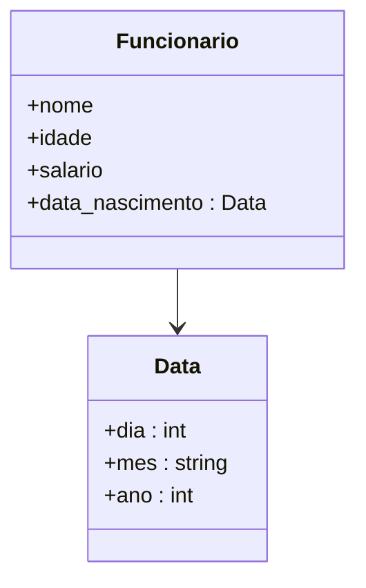
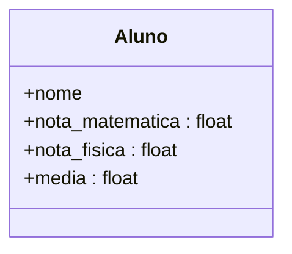
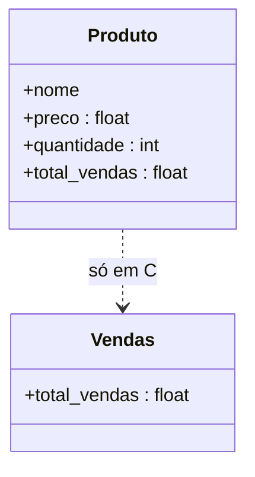

<h1 align="center">📚 Exercícios — Aula 01: Tipos Estruturados de Dados (`struct`)</h1>

<p align="center">
  
  
  
</p>

> 🎯 **Tema:** `struct`, vetores/arrays e organização de dados compostos.
> 🏫 Fonte: slide *"Exercícios"* — @CESAR 2021 · Todos os Direitos Reservados.

<h2 align="left" id="🗂️-índice"><br>🗂️ Índice</h2>

<p align="left">
  
</p>

| # | Exercício | Conceito-chave | Arquivos |
|---|-----------|-----------------|----------|
| 1️⃣ | [Cadastro de Funcionários](#1️⃣-cadastro-de-funcionários) | `struct` aninhada (`Data` dentro de `Funcionario`) | [`c/1.c`](<../exércicios - aula 01/c/1.c>) · [`c++/1.cc`](<../exércicios - aula 01/c++/1.cc>) |
| 2️⃣ | [Boletim de Alunos](#2️⃣-boletim-de-alunos) | `struct` simples + cálculo de média | [`c/2.c`](<../exércicios - aula 01/c/2.c>) · [`c++/2.cc`](<../exércicios - aula 01/c++/2.cc>) |
| 3️⃣ | [Controle de Vendas](#3️⃣-controle-de-vendas) | vetor de `struct` (10 posições) + acumulador | [`c/3.c`](<../exércicios - aula 01/c/3.c>) · [`c++/3.cc`](<../exércicios - aula 01/c++/3.cc>) |

<h2 align="left" id="1️⃣-cadastro-de-funcionários"><br>1️⃣ Cadastro de Funcionários</h2>

<p align="left">
  
</p>

  

### 📋 Enunciado

> Crie um programa que leia e apresente os dados de **3 funcionários**. Crie uma `struct` que contenha o **nome, idade, salário** e a **data de nascimento**. O que se sabe é que a data de nascimento é do tipo `Data`, ou seja, uma outra `struct` que contém os seguintes membros: **dia e ano**, ambos do tipo inteiro; e **mês** do tipo `string`. Crie um **vetor de struct** para registrar os dados dos 3 funcionários.

### 🧩 Modelagem dos dados



> 🔗 `Funcionario` **possui** uma `Data` (composição). No código em C isso vira uma `struct` anônima aninhada dentro de `Funcionario`; no C++, `Data` é uma `struct` nomeada e independente, e `Funcionario` simplesmente declara um campo do tipo `Data` — veja a comparação abaixo.

### ⚖️ C vs C++ — como cada exemplo resolve

| Aspecto | 🔵 `c/1.c` | 🟣 `c++/1.cc` |
|---|---|---|
| `struct` aninhada | `struct` sem nome dentro de `Funcionario`, acessada via `.data_nascimento.dia` | `struct Data` nomeada e reutilizável, composta dentro de `Funcionario` |
| Texto (nome/mês) | `char nome[100]` / `char mes[20]` (buffer fixo) | `std::string` (tamanho dinâmico) |
| Vetor de registros | `Funcionario funcionarios[3]` (array C puro) | `std::array<Funcionario, TOTAL_FUNCIONARIOS>` |
| Leitura de string com espaço | `scanf(" %[^\n]s", ...)` | `std::getline(std::cin >> std::ws, ...)` |
| Validação do mês | laço `for` comparando com `char *meses_validos[12]` | função `mes_e_valido()` iterando um `std::array<std::string, 12>` |
| Validação do dia | `if` único (sem repetir a pergunta em loop) | `do...while` repete até o dia ser válido (1–31) |

### 🔵 Código em C

```c
#include <stdio.h>
#include <string.h>

typedef struct
{
    char nome[100];
    int idade;
    float salario;
    struct
    {
        int dia;
        char mes[20];
        int ano;
    } data_nascimento;
} Funcionario;
```
📄 Implementação completa: [`AED/exércicios - aula 01/c/1.c`](<../exércicios - aula 01/c/1.c>)

### 🟣 Código em C++

```cpp
#include <array>
#include <iostream>
#include <string>

struct Data
{
    int dia;
    std::string mes;
    int ano;
};

struct Funcionario
{
    std::string nome;
    int idade;
    float salario;
    Data data_nascimento;
};
```
📄 Implementação completa: [`AED/exércicios - aula 01/c++/1.cc`](<../exércicios - aula 01/c++/1.cc>)

### 💡 Ponto de aprendizado
Em **C**, a `struct Data` é declarada *inline* (sem nome, anônima) diretamente dentro de `Funcionario` — funciona, mas não pode ser reaproveitada em outro lugar do programa. Em **C++**, `Data` vira um tipo próprio e nomeado, o que permite reutilizá-la (ex.: uma futura `data_admissao`) sem duplicar código.

<h2 align="left" id="2️⃣-boletim-de-alunos"><br>2️⃣ Boletim de Alunos</h2>

<p align="left">
  
</p>

  

### 📋 Enunciado

> Defina uma `struct` para estruturar dados de alunos de uma escola. Dentro dessa `struct`, crie uma variável para armazenar o **nome do aluno**, e outras para armazenar as **notas de matemática, física** e a **média** dessas duas notas. Após definir a `struct`, crie **três variáveis** do tipo `struct` que você criou. Preencha os nomes e as notas dos alunos, calculando automaticamente a média deles.

### 🧩 Modelagem dos dados



> 🔗 Aqui não há aninhamento: `Aluno` é uma `struct` "achatada", com todos os campos no mesmo nível — diferente do exercício 1, em que `Funcionario` compõe `Data`. Em **C**, essa classe vira o `typedef struct { ... } Aluno;` abaixo, instanciado três vezes (`aluno1`, `aluno2`, `aluno3`), como pede o enunciado ao pé da letra. Em **C++**, o mesmo `struct Aluno` é reaproveitado dentro de um `std::array<Aluno, 3>`, guardando as mesmas três instâncias em uma coleção iterável.

### ⚖️ C vs C++ — como cada exemplo resolve

| Aspecto | 🔵 `c/2.c` | 🟣 `c++/2.cc` |
|---|---|---|
| "Três variáveis" pedidas no enunciado | `Aluno aluno1, aluno2, aluno3;` (literal, uma por nome) | `std::array<Aluno, TOTAL_ALUNOS> alunos;` (mesma ideia, via vetor + laço) |
| Selecionar qual aluno usar no laço | operador ternário aninhado `(i==0) ? aluno1... : (i==1) ? aluno2... : aluno3...` | indexação direta `alunos[indice_aluno]` — sem ternários |
| Nome do aluno | `scanf("%s", ...)` — **não aceita espaço** no nome | `std::getline(std::cin >> std::ws, aluno.nome)` — aceita nome composto |
| Cálculo da média | `if / else if / else` repetido para cada aluno | uma única linha, reaproveitada pelo laço: `aluno.media = (m + f) / 2` |

> ⚠️ **Observação didática:** o exemplo em C segue o enunciado ao pé da letra (três variáveis nomeadas `aluno1`, `aluno2`, `aluno3`), o que obriga a usar ternários para simular o "laço". Já o C++ resolve o mesmo requisito com um `std::array` de 3 posições — mais limpo, mesmo resultado.

### 🔵 Código em C

```c
typedef struct
{
    char nome[MAX_NOME];
    float nota_Matematica;
    float nota_Fisica;
    float media;
} Aluno;

Aluno aluno1, aluno2, aluno3;
```
📄 Implementação completa: [`AED/exércicios - aula 01/c/2.c`](<../exércicios - aula 01/c/2.c>)

### 🟣 Código em C++

```cpp
struct Aluno
{
    std::string nome;
    float nota_matematica;
    float nota_fisica;
    float media;
};

std::array<Aluno, TOTAL_ALUNOS> alunos;
```
📄 Implementação completa: [`AED/exércicios - aula 01/c++/2.cc`](<../exércicios - aula 01/c++/2.cc>)

<h2 align="left" id="3️⃣-controle-de-vendas"><br>3️⃣ Controle de Vendas</h2>

<p align="left">
  
</p>

  

### 📋 Enunciado

> Crie um programa que leia a venda de **10 produtos** (use um vetor). De cada produto queremos saber o **nome, preço, quantidade** de um produto vendido, e mostre também o **valor total das vendas**. Use `struct`s para estruturar os dados.

### 🧩 Modelagem dos dados



> 🔗 Conceitualmente `Produto` tem um campo `total_vendas`, achatado como em `Aluno` (exercício 2). Só que o exemplo em **C** dá um passo a mais e cria uma `struct Vendas` anônima só para guardar esse único campo (`produtos[i].vendas.total_vendas`) — por isso ela aparece pontilhada no diagrama, ligada por "só em C". Em **C++**, `total_vendas` fica direto em `Produto` (`produto.total_vendas`), sem esse nível extra de aninhamento — mais fiel ao modelo "achatado" do diagrama.

### ⚖️ C vs C++ — como cada exemplo resolve

| Aspecto | 🔵 `c/3.c` | 🟣 `c++/3.cc` |
|---|---|---|
| Total de vendas por produto | `struct` aninhada anônima `{ float total_vendas; } vendas;` → acesso `.vendas.total_vendas` | campo simples `float total_vendas;` direto em `Produto` |
| Vetor de produtos | `Produto produtos[TOTAL_PRODUTOS]` | `std::array<Produto, TOTAL_PRODUTOS> produtos` |
| Acesso no laço de saída | `produtos[indice_produto].nome` (repetido) | `const Produto &produto : produtos` (referência, evita repetir índice) |
| Formatação do resumo | `printf` com múltiplos `%s`/`%.2f` numa linha | `std::cout` encadeado com `<<` |
| Acumulador do total geral | `valor_total_vendas += produtos[i].vendas.total_vendas;` | `valor_total_vendas += produto.total_vendas;` |

### 🔵 Código em C

```c
typedef struct Produto
{
    char nome[MAX_NOME_PRODUTO];
    float preco;
    int quantidade;
    struct
    {
        float total_vendas;
    } vendas;
} Produto;

Produto produtos[TOTAL_PRODUTOS];
```
📄 Implementação completa: [`AED/exércicios - aula 01/c/3.c`](<../exércicios - aula 01/c/3.c>)

### 🟣 Código em C++

```cpp
struct Produto
{
    std::string nome;
    float preco;
    int quantidade;
    float total_vendas;
};

std::array<Produto, TOTAL_PRODUTOS> produtos;
```
📄 Implementação completa: [`AED/exércicios - aula 01/c++/3.cc`](<../exércicios - aula 01/c++/3.cc>)

### 💡 Ponto de aprendizado
Repare que em C o `total_vendas` foi colocado dentro de uma `struct` aninhada só com esse campo (`vendas.total_vendas`) — funciona, mas é um nível de aninhamento desnecessário, já que não há outros campos relacionados a "vendas". No C++ o mesmo dado vira um campo simples de `Produto`, deixando o acesso mais direto (`produto.total_vendas`).

<h2 align="left" id="🧠-resumo-geral-c-vs-c-neste-conjunto-de-exercícios"><br>🧠 Resumo geral: C vs C++ neste conjunto de exercícios</h2>

<p align="left">
  
</p>

| Recurso | 🔵 C | 🟣 C++ |
|---|---|---|
| Strings | `char[]` de tamanho fixo | `std::string` |
| Coleção de `struct`s | array bruto `Tipo nome[N]` | `std::array<Tipo, N>` |
| Leitura de texto com espaço | `scanf(" %[^\n]s", var)` | `std::getline(std::cin >> std::ws, var)` |
| E/S | `printf` / `scanf` | `std::cout` / `std::cin` |
| Percorrer coleção na saída | índice manual `v[i]` | *range-based for* `for (auto &x : v)` |

<p align="center"><sub>📁 Diretório de origem dos exercícios: <code>AED/exércicios - aula 01/</code> · 🖼️ Enunciado original: <code>img/exércicios.jpeg</code></sub></p>
