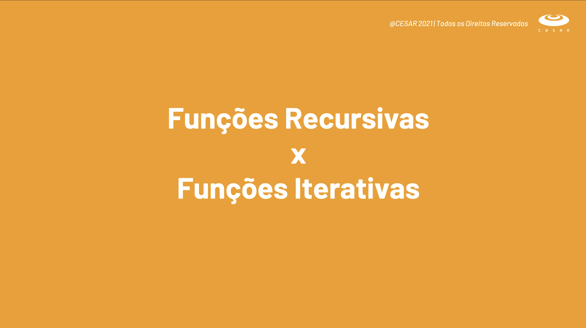
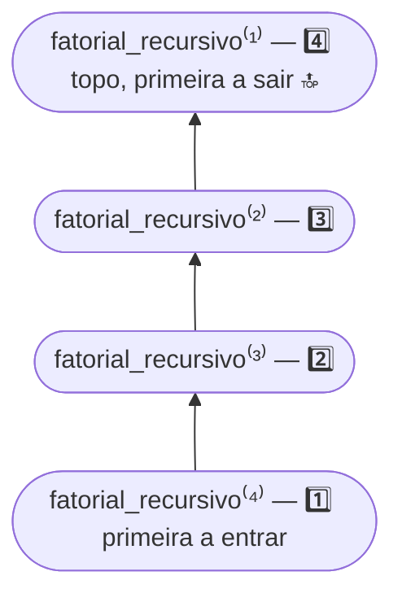
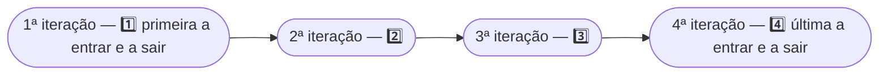
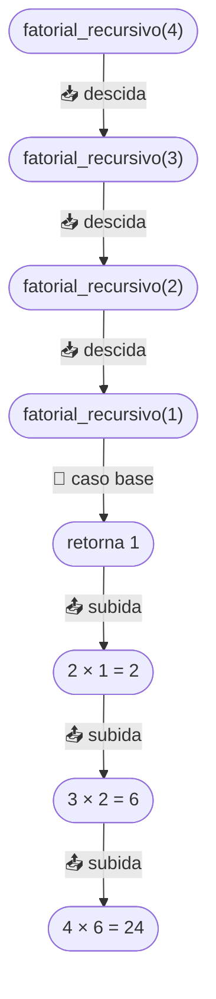
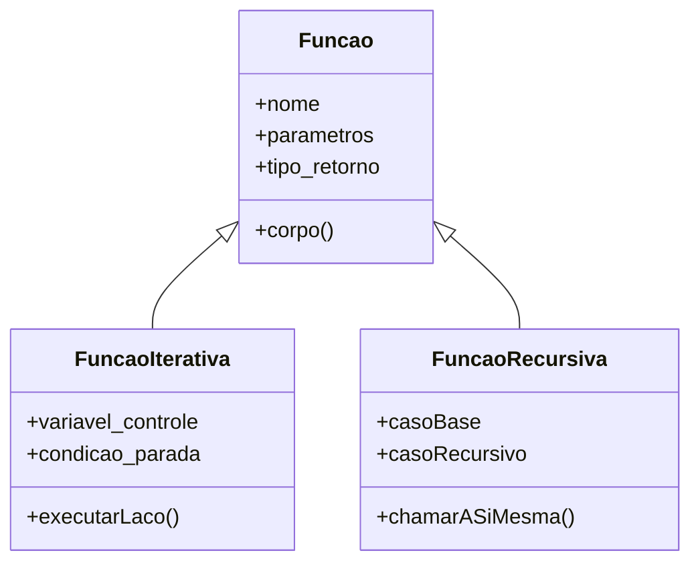
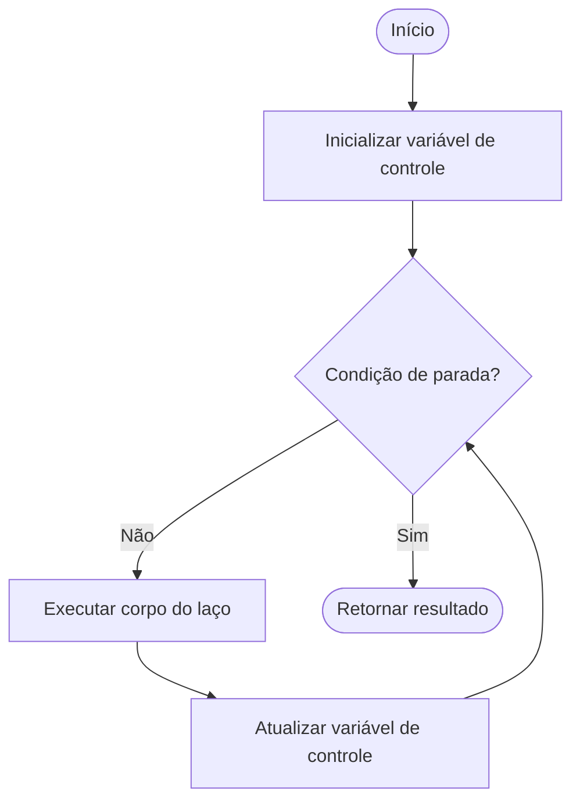
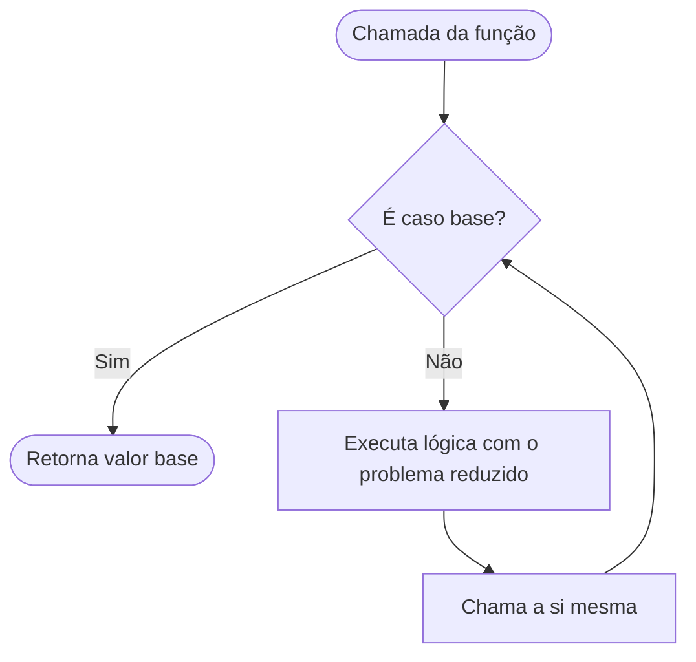
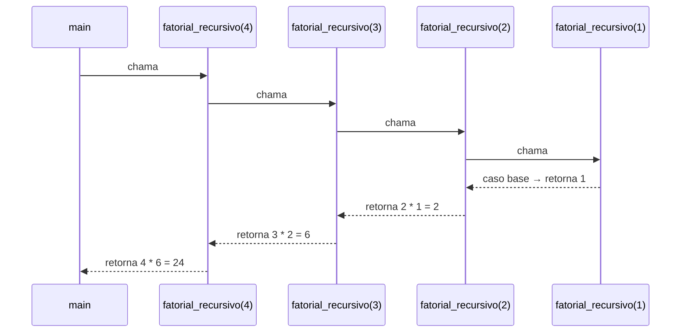

<h1 align="center">🔁 Funções Recursivas × Iterativas <br>
</h1>

<p align="center">
    
    
    
    
    
</p>

> 📘 Material de apoio da **aula 02** — comparação detalhada entre **funções iterativas** (baseadas em laços) e **funções recursivas** (baseadas em chamadas de si mesmas), com teoria, diagramas e exemplos reais em **C** e **C++**.

<h2 align="left">🧭 Sumário</h2>

1. [O que é uma função](#1-o-que-e-uma-funcao)
2. [Funções Iterativas](#2-funcoes-iterativas)
3. [Funções Recursivas](#3-funcoes-recursivas)
4. [LIFO × FIFO — a estrutura por trás de cada função](#4-lifo-fifo)
5. [Anatomia de uma recursão](#5-anatomia-de-uma-recursao)
6. [Recursão × Iteração — comparação direta](#6-recursao-x-iteracao)
7. [Exemplos práticos](#7-exemplos-praticos)
   - [7.1 Fatorial](#71-fatorial)
   - [7.2 Fibonacci](#72-fibonacci)
   - [7.3 Inverter uma string (recursivo)](#73-inverter-string)
   - [7.4 MDC — Máximo Divisor Comum (recursivo)](#74-mdc)
8. [Quando usar cada abordagem](#8-quando-usar-cada-abordagem)
9. [Armadilhas comuns](#9-armadilhas-comuns)
10. [Modelagem visual das funções](#10-modelagem-visual-das-funcoes)
11. [Resumo final](#11-resumo-final)

<h2 align="left" id="1-o-que-e-uma-funcao">🧩 1. O que é uma função?</h2>

Uma **função** é um bloco de código nomeado que executa uma tarefa específica e pode ser **chamado (invocado)** quantas vezes forem necessárias. Toda função possui:

| Elemento | Descrição |
|---|---|
| 🏷️ **Assinatura** | Nome, tipo de retorno e parâmetros |
| 📥 **Entrada** | Parâmetros recebidos |
| ⚙️ **Corpo** | Instruções executadas |
| 📤 **Saída** | Valor retornado (ou `void`) |

A forma como uma função **repete um processamento** é o que define se ela é **iterativa** ou **recursiva**.

<h2 align="left" id="2-funcoes-iterativas">🔂 2. Funções Iterativas</h2>

Uma função é **iterativa** quando repete um bloco de instruções usando **estruturas de repetição** (`for`, `while`, `do...while`), controlando o fluxo por meio de **variáveis de controle** (contadores, índices, condições de parada).

### ✅ Características

| Característica | Descrição |
|---|---|
| 🔁 Mecanismo | Laços (`for`, `while`, `do while`) |
| 🧠 Memória | Usa **uma única** área de memória (sem empilhar chamadas) |
| ⚡ Desempenho | Geralmente mais rápida — sem overhead de chamadas de função |
| 📏 Estado | Mantido em variáveis que são atualizadas a cada repetição |
| 🛑 Parada | Definida por uma condição booleana no laço |

### 💻 Exemplo — Fatorial iterativo em C

```c
#include <stdio.h>

int fatorial_iterativo(int numero)
{
    int resultado = 1;

    for (int indice_numero = 1; indice_numero <= numero; indice_numero++)
    {
        resultado *= indice_numero;
    }

    return resultado;
}

int main(void)
{
    int numero = 5;
    printf("Fatorial de %d = %d\n", numero, fatorial_iterativo(numero));
    return 0;
}
```

> 🔎 Repare que o **estado** (`resultado`) é atualizado a cada volta do `for`, sem que a função chame a si mesma.

<h2 align="left" id="3-funcoes-recursivas">🌀 3. Funções Recursivas</h2>

Uma função é **recursiva** quando ela **chama a si mesma**, direta ou indiretamente, para resolver um problema **dividindo-o em subproblemas menores e semelhantes**.

### ✅ Características

| Característica | Descrição |
|---|---|
| 🔁 Mecanismo | A própria função se chama (auto-referência) |
| 🧠 Memória | Cada chamada empilha um **novo quadro** na *pilha de execução* (call stack) |
| ⚡ Desempenho | Pode ser mais lenta — overhead de múltiplas chamadas |
| 🎯 Estrutura | Precisa de **caso base** e **caso recursivo** |
| 🛑 Parada | Definida pelo **caso base**, que interrompe as chamadas |

### 🧱 Estrutura obrigatória de toda função recursiva

```c
tipo_retorno funcao_recursiva(parametros)
{
    if (condicao_do_caso_base)      
    // 🛑 impede a recursão infinita
    {
        return valor_base;
    }
    else                             
    // 🔁 case recursivo
    {
        return funcao_recursiva(parametros_reduzidos);
    }
}
```

> ⚠️ **Toda recursão sem caso base gera *stack overflow*** — a pilha de chamadas cresce indefinidamente até estourar a memória disponível.

<h3 align="left">💻 Exemplo — Fatorial recursivo em C</h3>

```c
#include <stdio.h>

int fatorial_recursivo(int numero)
{
    if (numero <= 1)                 
    // 🛑 caso base
    {
        return 1;
    }
    else                              
    // 🔁 caso recursivo
    {
        return numero * fatorial_recursivo(numero - 1);
    }
}

int main(void)
{
    int numero = 5;
    printf("Fatorial de %d = %d\n", numero, fatorial_recursivo(numero));
    return 0;
}
```

<h3 align="left">💻 O mesmo exemplo em C++</h3>

```cpp
#include <iostream>

int fatorial_recursivo(int numero)
{
    if (numero <= 1)                 
    // 🛑 caso base
    {
        return 1;
    }
    else                              
    // 🔁 caso recursivo
    {
        return numero * fatorial_recursivo(numero - 1);
    }
}

int main(void)
{
    int numero = 5;
    std::cout << "Fatorial de " << numero << " = " << fatorial_recursivo(numero) << "\n";
    return 0;
}
```

<h2 align="left" id="4-lifo-fifo">🥞 4. LIFO × FIFO — a estrutura por trás de cada função</h2>

Toda forma de repetição carrega, implicitamente, uma **ordem de processamento**. Essa ordem pode ser comparada às duas estruturas de dados clássicas: **pilha** e **fila**.

| Tipo de função | Estrutura análoga | Sigla | Ordem de processamento |
|---|---|---|---|
| 🌀 **Recursiva** | 🥞 Pilha (*Stack*) | **LIFO** — *Last In, First Out* | A **última** chamada empilhada é a **primeira** a retornar |
| 🔁 **Iterativa** | 🚶 Fila conceitual (sequência) | **FIFO** — *First In, First Out* | O **primeiro** passo do laço é o **primeiro** a ser concluído, na mesma ordem em que começou |

### 🌀 Recursão → LIFO

Cada chamada recursiva é **empilhada (push)** na *call stack* do programa. A função só recebe seu resultado quando a chamada do **topo da pilha** retorna — ou seja, a **última a entrar é a primeira a sair (pop)**.

```
push fatorial_recursivo(4)
  push fatorial_recursivo(3)
    push fatorial_recursivo(2)
      push fatorial_recursivo(1)   ← 🔝 topo: última a entrar
      pop  fatorial_recursivo(1)   ← 🔝 primeira a sair
    pop  fatorial_recursivo(2)
  pop  fatorial_recursivo(3)
pop  fatorial_recursivo(4)         ← base: primeira a entrar, última a sair
```

### 🔁 Iteração → FIFO

Num laço, os passos são executados **na mesma ordem em que aparecem**: a 1ª iteração é a primeira a ser processada e concluída, a 2ª vem em seguida, e assim por diante — sem "empilhar" nada à espera de um retorno posterior.

```
entra 1ª iteração → processa → sai 1ª iteração
entra 2ª iteração → processa → sai 2ª iteração
entra 3ª iteração → processa → sai 3ª iteração
```

> 💡 Ao percorrer um vetor com `for`, o **primeiro** elemento lido é o **primeiro** a ser totalmente processado (**FIFO**). Já numa recursão, a **primeira** chamada feita só "termina" **por último** (**LIFO**).

### 🗺️ Modelagem visual — LIFO × FIFO

<h3 align="center">🥞 Pilha (LIFO) da recursão</h3>



<h3 align="center">🚶 Fila conceitual (FIFO) da iteração</h3>



> 🧠 Nas duas modelagens acima, a **direção da seta** representa a ordem de entrada; a diferença é **quem sai primeiro** — o topo da pilha (LIFO) ou o primeiro da fila (FIFO).

---

<h2 align="left" id="5-anatomia-de-uma-recursao">🔬 5. Anatomia de uma recursão</h2>

Cada chamada recursiva gera um **quadro de pilha (stack frame)** próprio, com suas variáveis locais. O programa só começa a "voltar" (retornar valores) quando o **caso base** é atingido.

### 📚 Pilha de chamadas de `fatorial_recursivo(4)`

```
fatorial_recursivo(4)
└─ 4 * fatorial_recursivo(3)
   └─ 3 * fatorial_recursivo(2)
      └─ 2 * fatorial_recursivo(1)
         └─ caso base → retorna 1
      ↩ retorna 2 * 1 = 2
   ↩ retorna 3 * 2 = 6
↩ retorna 4 * 6 = 24
```

### 🥞 Desenho da pilha (LIFO) de `fatorial_recursivo(4)`

```
                    🔺 DESEMPILHANDO (retorno dos valores) 🔺

        ┌─────────────────────────────────┐
        │  fatorial_recursivo(1) = 1       │  ← 4️⃣ topo da pilha (última a entrar)
        ├─────────────────────────────────┤
        │  fatorial_recursivo(2)           │  ← 3️⃣ aguardando retorno de (1)
        ├─────────────────────────────────┤
        │  fatorial_recursivo(3)           │  ← 2️⃣ aguardando retorno de (2)
        ├─────────────────────────────────┤
        │  fatorial_recursivo(4)           │  ← 1️⃣ base da pilha (primeira a entrar)
        └─────────────────────────────────┘

                    🔻 EMPILHANDO (chamadas recursivas) 🔻
```

> 🥞 Note o padrão **LIFO**: `fatorial_recursivo(1)` foi a **última** chamada empilhada e é a **primeira** a retornar (topo da pilha); `fatorial_recursivo(4)` foi a **primeira** a ser empilhada e só retorna **por último** (base da pilha).

| Fase | O que acontece? |
|---|---|
| 📥 **Descida (chamadas)** | A função empilha uma chamada por vez, reduzindo o problema |
| 🛑 **Caso base** | Interrompe as chamadas e inicia o retorno |
| 📤 **Subida (retornos)** | Cada chamada retorna seu resultado para a chamada anterior |

### 🗺️ Modelagem visual — fases da recursão

<h3 align="center">🔬 Descida → Caso base → Subida — fatorial_recursivo(4)</h3>



> 🧠 O caminho de **descida** (📥) reduz o problema a cada chamada; ao atingir o **caso base** (🛑), a recursão inverte o sentido e inicia a **subida** (📤), compondo o resultado final.

---

<h2 align="left" id="6-recursao-x-iteracao">⚖️ 6. Recursão × Iteração — comparação direta</h2>

| Critério | 🔁 Iterativa | 🌀 Recursiva |
|---|---|---|
| **Mecanismo de repetição** | `for` / `while` / `do while` | Chamada da própria função |
| **Consumo de memória** | Baixo (variáveis reaproveitadas) | Alto (uma pilha por chamada) |
| **Velocidade** | Geralmente mais rápida | Geralmente mais lenta (overhead de chamadas) |
| **Legibilidade** | Melhor para laços simples | Melhor para problemas naturalmente recursivos (árvores, divisão e conquista) |
| **Risco de erro** | Loop infinito (condição mal formulada) | *Stack overflow* (sem caso base) |
| **Exemplo típico** | Somar elementos de um vetor | Percorrer uma árvore, torres de Hanói |
| **Conversão** | Pode sempre ser reescrita como recursiva | Pode sempre ser reescrita como iterativa |

> 💡 **Regra prática:** tudo que é recursivo pode virar iterativo (usando uma pilha manual), e vice-versa. A escolha é sobre **clareza** e **custo de memória/desempenho**, não sobre capacidade.

<h2 align="left" id="7-exemplos-praticos">🧪 7. Exemplos práticos</h2>

<h3 align="left" id="71-fatorial">7.1 Fatorial</h3>

<table>
<tr><th>🔁 Iterativo (C)</th><th>🌀 Recursivo (C)</th></tr>
<tr>
<td>

```c
int fatorial_iterativo(int n)
{
    int resultado = 1;

    for (int i = 1; i <= n; i++)
    {
        resultado *= i;
    }

    return resultado;
}
```

</td>
<td>

```c
int fatorial_recursivo(int n)
{
    if (n <= 1)
    {
        return 1;
    }
    else
    {
        return n * fatorial_recursivo(n - 1);
    }
}
```

</td>
</tr>
</table>

📄 Ver implementação completa (com leitura de dados) em [`fatorial.c`](../fatorial.c).

<h3 align="left" id="72-fibonacci">7.2 Fibonacci</h3>

A sequência de Fibonacci é um clássico para ilustrar a diferença de **desempenho** entre as duas abordagens: a versão recursiva "ingênua" recalcula os mesmos termos várias vezes (complexidade exponencial), enquanto a iterativa resolve em tempo linear.

<table>
<tr><th>🔁 Iterativo (C) — O(n)</th><th>🌀 Recursivo (C) — O(2ⁿ)</th></tr>
<tr>
<td>

```c
int fibonacci_iterativo(int n)
{
    int anterior = 0, atual = 1;

    for (int i = 2; i <= n; i++)
    {
        int proximo = anterior + atual;
        anterior = atual;
        atual = proximo;
    }

    return (n == 0) ? anterior : atual;
}
```

</td>
<td>

```c
int fibonacci_recursivo(int n)
{
    if (n <= 1)                 
    // 🛑 caso base
    {
        return n;
    }
    else                          
    // 🔁 caso recursivo
    {
        return fibonacci_recursivo(n - 1)
             + fibonacci_recursivo(n - 2);
    }
}
```

</td>
</tr>
</table>

> ⚠️ **Cuidado:** `fibonacci_recursivo(40)` já realiza milhões de chamadas repetidas. Para recursão eficiente, usa-se **memoização** (guardar resultados já calculados).

📄 Ver implementação completa (com leitura de dados) em [`fibonacci.c`](../fibonacci.c).

<h3 align="left" id="73-inverter-string">7.3 Inverter uma string (recursivo)</h3>

Problema em que a recursão é natural: inverter os extremos e recursivamente inverter o miolo da string.

**C** — [`c/1.c`](../c/1.c)

```c
int inverter_string_recursivo(char *str, int indice_inicio, int indice_fim)
{
    if (indice_inicio >= indice_fim)          
    // 🛑 caso base
    {
        return 1;
    }
    else                                        
    // 🔁 caso recursivo
    {
        char caractere_temporario = str[indice_inicio];
        str[indice_inicio] = str[indice_fim];
        str[indice_fim] = caractere_temporario;

        return inverter_string_recursivo(str, indice_inicio + 1, indice_fim - 1);
    }
}
```

**C++** — [`c++/1.cc`](../c++/1.cc)

```cpp
std::string inverter_string_recursivo(const std::string &str, int indice_inicio, int indice_fim)
{
    if (indice_inicio >= indice_fim)          
    // 🛑 caso base
    {
        return str;
    }
    else                                       
    // 🔁 caso recursivo
    {
        std::string str_invertida = str;
        char caractere_temporario = str_invertida[indice_inicio];
        str_invertida[indice_inicio] = str_invertida[indice_fim];
        str_invertida[indice_fim] = caractere_temporario;

        return inverter_string_recursivo(str_invertida, indice_inicio + 1, indice_fim - 1);
    }
}
```

<h3 align="left" id="74-mdc">7.4 MDC — Máximo Divisor Comum (recursivo)</h3>

Implementação clássica do **Algoritmo de Euclides**, um dos exemplos mais elegantes de recursão.

**C** — [`c/2.c`](../c/2.c)

```c
int mdc_recursivo(int numero1, int numero2)
{
    if (numero2 == 0)                    
    // 🛑 caso base
    {
        return numero1;
    }
    else                                    
    // 🔁 caso recursivo
    {
        return mdc_recursivo(numero2, numero1 % numero2);
    }
}
```

**C++** — [`c++/2.cc`](../c++/2.cc)

```cpp
int mdc_recursivo(int numero1, int numero2)
{
    if (numero2 == 0)                    
    // 🛑 caso base
    {
        return numero1;
    }
    else                                    
    // 🔁 caso recursivo
    {
        return mdc_recursivo(numero2, numero1 % numero2);
    }
}
```

| Chamada | numero1 | numero2 | resultado |
|---|---|---|---|
| `mdc_recursivo(48, 18)` | 48 | 18 | → `mdc_recursivo(18, 12)` |
| `mdc_recursivo(18, 12)` | 18 | 12 | → `mdc_recursivo(12, 6)` |
| `mdc_recursivo(12, 6)` | 12 | 6 | → `mdc_recursivo(6, 0)` |
| `mdc_recursivo(6, 0)` | 6 | 0 | 🛑 retorna **6** |

---

<h2 align="left" id="8-quando-usar-cada-abordagem">🧠 8. Quando usar cada abordagem</h2>

| Use **iteração** quando... | Use **recursão** quando... |
|---|---|
| ✅ O problema é uma repetição simples e linear | ✅ O problema é naturalmente dividido em subproblemas menores e iguais |
| ✅ Desempenho e memória são críticos | ✅ A estrutura de dados é recursiva (árvores, grafos, listas encadeadas) |
| ✅ Você quer evitar risco de *stack overflow* | ✅ A solução recursiva é mais legível que a iterativa equivalente |
| ✅ O número de repetições pode ser muito grande | ✅ O número de chamadas é limitado e controlado |

---

<h2 align="left" id="9-armadilhas-comuns">🚧 9. Armadilhas comuns</h2>

| ⚠️ Problema | 💥 Consequência | 🛠️ Como evitar |
|---|---|---|
| Recursão sem caso base | *Stack overflow* | Sempre defina uma condição de parada clara |
| Caso base incorreto | Resultado errado ou loop infinito | Teste o caso base isoladamente |
| Recursão que recalcula os mesmos subproblemas | Explosão de tempo de execução (ex.: Fibonacci ingênuo) | Usar memoização ou programação dinâmica |
| Laço `for`/`while` sem atualizar a condição de parada | Loop infinito | Garantir que a variável de controle avance a cada iteração |

<h2 align="left" id="10-modelagem-visual-das-funcoes">🗺️ 10. Modelagem visual das funções</h2>

Assim como uma classe pode ser modelada em UML, o **comportamento** de uma função também pode ser representado visualmente. Abaixo, os dois tipos de função e o fluxo de uma recursão estão modelados com diagramas [Mermaid](https://mermaid.js.org/).

<h3 align="center">🧩 Modelagem conceitual das funções</h3>



> 🧠 `FuncaoIterativa` e `FuncaoRecursiva` são especializações de `Funcao`: ambas recebem parâmetros e retornam um valor, mas divergem em **como** repetem o processamento — uma via laço, a outra via auto-chamada.

<h3 align="center">🔁 Fluxo de controle — função iterativa</h3>



<h3 align="center">🌀 Fluxo de controle — função recursiva</h3>



<h3 align="center">📚 Pilha de chamadas — fatorial_recursivo(4)</h3>



---

<h2 align="left" id="11-resumo-final">📌 11. Resumo final</h2>

```
┌───────────────────────────────────────────────────────────┐
│  ITERAÇÃO                     │  RECURSÃO                  │
├───────────────────────────────┼─────────────────────────────┤
│  🔁 for / while                │  🌀 função chama a si mesma │
│  🧠 memória constante           │  🧠 memória cresce por chamada │
│  ⚡ geralmente mais rápida      │  🎯 código mais expressivo   │
│  🎯 problemas lineares          │  🎯 problemas recursivos     │
└───────────────────────────────────────────────────────────┘
```

> 🎓 **Conclusão:** não existe abordagem "melhor" de forma absoluta — existe a abordagem **mais adequada ao problema**. Dominar as duas é o que permite escolher a ferramenta certa para cada situação.