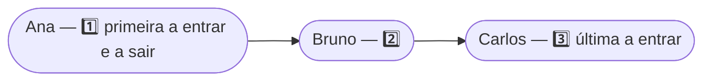
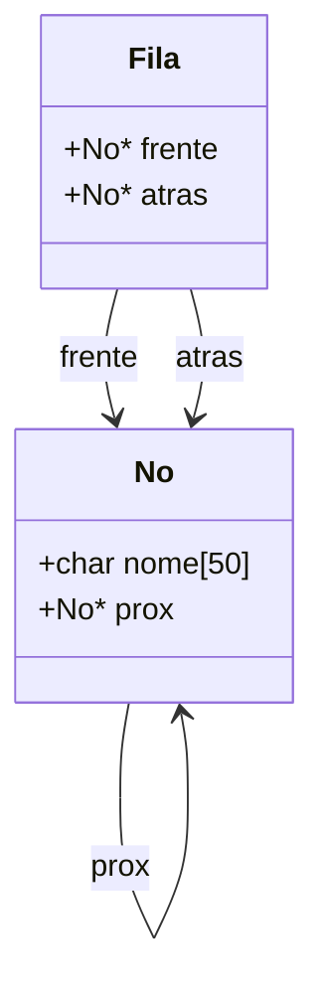

<h1 align="center">🚶 Filas (Queues)</h1>

<p align="center">
    
    
    
    
    
</p>

> 📘 Material de apoio da **aula 03** — o que é uma **fila (queue)**, a ordem **FIFO**, as operações de enfileirar/desenfileirar com ponteiros de frente e trás, e implementações em **C** e **C++**.

<h2 align="left">🧭 Sumário</h2>

1. [O que é uma fila](#1-o-que-e-uma-fila)
2. [FIFO — First In, First Out](#2-fifo)
3. [Anatomia da fila](#3-anatomia-da-fila)
4. [Operações sobre a fila](#4-operacoes-sobre-a-fila)
   - [4.1 Criar a fila](#41-criar-a-fila)
   - [4.2 Enfileirar (enqueue)](#42-enfileirar-enqueue)
   - [4.3 Desenfileirar (dequeue)](#43-desenfileirar-dequeue)
   - [4.4 Percorrer e imprimir](#44-percorrer-e-imprimir)
5. [Por que dois ponteiros (frente e atrás)?](#5-por-que-dois-ponteiros)
6. [Implementação completa](#6-implementacao-completa)
7. [Complexidade das operações](#7-complexidade-das-operacoes)
8. [Fila × Pilha — comparação direta](#8-fila-x-pilha)
9. [Armadilhas comuns](#9-armadilhas-comuns)
10. [Resumo final](#10-resumo-final)

<h2 align="left" id="1-o-que-e-uma-fila">🧩 1. O que é uma fila?</h2>

Uma **fila** (*queue*) é uma estrutura de dados linear em que a inserção acontece em uma extremidade (**trás**) e a remoção na outra (**frente**) — exatamente como uma fila de pessoas: quem chega entra no fim, quem é atendido sai da frente.

| Característica | Descrição |
|---|---|
| ➕ Inserir | `enfileirar` / *enqueue* — sempre no **fim** (trás) |
| ➖ Remover | `desenfileirar` / *dequeue* — sempre do **início** (frente) |
| 🔁 Ordem | **FIFO** — *First In, First Out* |
| ⚡ Custo | **O(1)** para enfileirar e desenfileirar (com ponteiro de trás) |

<h2 align="left" id="2-fifo">🚶 2. FIFO — First In, First Out</h2>

O **primeiro** elemento a entrar na fila é o **primeiro** a sair — sem "furar fila".



<h2 align="left" id="3-anatomia-da-fila">🔬 3. Anatomia da fila</h2>

Cada nó guarda um dado e o ponteiro para o próximo. A estrutura `Fila` guarda **dois** ponteiros: `frente` (para remover) e `atras` (para inserir rapidamente, sem percorrer a lista).

```c
typedef struct No
{
    char nome[50];
    struct No *prox;
} No;

typedef struct
{
    No *frente;
    No *atras;
} Fila;
```



<h2 align="left" id="4-operacoes-sobre-a-fila">⚙️ 4. Operações sobre a fila</h2>

<h3 align="left" id="41-criar-a-fila">4.1 Criar a fila</h3>

Uma fila nova começa vazia: `frente` e `atras` apontam para `NULL`.

```c
Fila *criar_fila(void)
{
    Fila *fila = (Fila *)malloc(sizeof(Fila));
    fila->frente = fila->atras = NULL;
    return fila;
}
```

<h3 align="left" id="42-enfileirar-enqueue">4.2 Enfileirar (enqueue)</h3>

O novo nó é conectado **após** o atual `atras`, e passa a ser o novo `atras`. Se a fila estava vazia, o novo nó vira `frente` **e** `atras` ao mesmo tempo.

```c
void enfileirar(Fila *fila, char nome[])
{
    No *novo = (No *)malloc(sizeof(No));
    strcpy(novo->nome, nome);
    novo->prox = NULL;

    if(!fila->atras)
    {
        fila->frente = fila->atras = novo;
    }
    else
    {
        fila->atras->prox = novo;
        fila->atras = novo;
    }
}
```

<h3 align="left" id="43-desenfileirar-dequeue">4.3 Desenfileirar (dequeue)</h3>

Remove o nó da `frente` e avança o ponteiro para o próximo. Se a fila ficar vazia, `atras` também deve voltar a `NULL`.

```c
void desenfileirar(Fila *fila)
{
    if(!fila->frente)
    {
        return;
    }
    else
    {
        No *temp = fila->frente;
        fila->frente = fila->frente->prox;

        if(!fila->frente)
        {
            fila->atras = NULL;
        }

        free(temp);
    }
}
```

> ⚠️ Esquecer de zerar `atras` quando a fila esvazia deixa a estrutura em um estado inconsistente — o próximo `enfileirar` pensaria que ainda há um `atras` válido.

<h3 align="left" id="44-percorrer-e-imprimir">4.4 Percorrer e imprimir</h3>

```c
void imprimir_fila(Fila *fila)
{
    No *temp = fila->frente;

    while(temp)
    {
        printf("%s <- ", temp->nome);
        temp = temp->prox;
    }

    printf("NULL\n");
}
```

<h2 align="left" id="5-por-que-dois-ponteiros">🔎 5. Por que dois ponteiros (frente e atrás)?</h2>

Sem o ponteiro `atras`, enfileirar exigiria **percorrer toda a fila** a cada inserção (como acontece em `inserir_fim` de uma lista comum) — custo **O(n)**. Guardando `atras`, o novo nó é conectado diretamente, em **O(1)**.

| Sem ponteiro `atras` | Com ponteiro `atras` |
|---|---|
| Percorre a fila inteira para achar o último nó | Acessa o último nó diretamente |
| Enfileirar custa **O(n)** | Enfileirar custa **O(1)** |

<h2 align="left" id="6-implementacao-completa">📄 6. Implementação completa</h2>

**C** — [`c/Filas.c`](../c/Filas.c)

**C++** — [`c++/Filas.cc`](../c++/Filas.cc)

| Aspecto | C | C++ |
|---|---|---|
| Alocação | `malloc(sizeof(No))` | `new No` |
| Liberação | `free(ponteiro)` | `delete ponteiro` |
| Entrada/saída | `printf` / `scanf` | `cout` / `cin` |

<h2 align="left" id="7-complexidade-das-operacoes">⚖️ 7. Complexidade das operações</h2>

| Operação | Complexidade | Motivo |
|---|---|---|
| Enfileirar (`enqueue`) | **O(1)** | Conecta direto ao ponteiro `atras` |
| Desenfileirar (`dequeue`) | **O(1)** | Remove direto do ponteiro `frente` |
| Consultar a frente | **O(1)** | Acesso direto via `frente->dado` |
| Buscar um valor qualquer | **O(n)** | É preciso percorrer nó a nó |

<h2 align="left" id="8-fila-x-pilha">🆚 8. Fila × Pilha — comparação direta</h2>

| Critério | 🚶 Fila | 🥞 Pilha |
|---|---|---|
| **Ordem** | FIFO — primeiro a entrar, primeiro a sair | LIFO — último a entrar, primeiro a sair |
| **Inserção** | Sempre no fim (trás) | Sempre no topo |
| **Remoção** | Sempre no início (frente) | Sempre no topo |
| **Ponteiros necessários** | 2 (`frente` e `atras`) | 1 (`topo`) |
| **Analogia** | Fila de banco | Pilha de pratos |

<h2 align="left" id="9-armadilhas-comuns">🚧 9. Armadilhas comuns</h2>

| ⚠️ Problema | 💥 Consequência | 🛠️ Como evitar |
|---|---|---|
| Desenfileirar sem checar se a fila está vazia | Acesso inválido de memória | Sempre checar `if(!fila->frente)` antes de remover |
| Não zerar `atras` quando a fila esvazia | Próximo `enfileirar` corrompe a estrutura | Checar `if(!fila->frente) fila->atras = NULL;` no `dequeue` |
| Confundir `frente` com `atras` ao inserir/remover | Fila com comportamento de pilha (LIFO) | Inserir sempre em `atras`, remover sempre de `frente` |
| Não dar `free` nos nós removidos | Vazamento de memória | `free(temp)` dentro da própria função de `dequeue` |

<h2 align="left" id="10-resumo-final">📌 10. Resumo final</h2>

```
┌───────────────────────────────────────────────────────────┐
│  FILA (QUEUE)                                                │
├───────────────────────────────────────────────────────────┤
│  🚶 dois pontos de acesso: frente (remove) e atrás (insere)  │
│  🔁 ordem FIFO — First In, First Out                          │
│  ➕ enfileirar (enqueue): O(1)                                │
│  ➖ desenfileirar (dequeue): O(1)                             │
│  🎯 usada em filas de impressão, atendimento, BFS em grafos   │
└───────────────────────────────────────────────────────────┘
```

> 🎓 **Conclusão:** manter os dois ponteiros (`frente` e `atras`) sincronizados é o que garante que enfileirar e desenfileirar custem O(1) — o mesmo princípio de "não perder a referência" que já vale para listas e pilhas.
