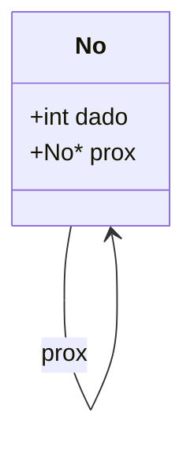
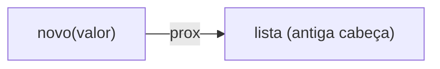
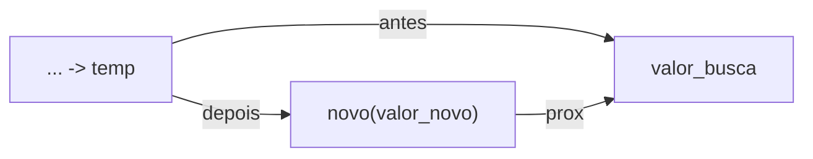
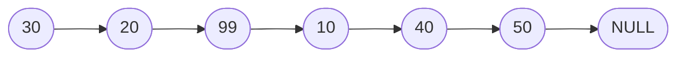

<h1 align="center">🔗 Listas Encadeadas</h1>

<p align="center">
    
    
    
    
    
</p>

> 📘 Material de apoio da **aula 03** — o que é uma **lista encadeada**, como ela é montada nó a nó em memória dinâmica e como inserir no início, no fim e no meio, com exemplos reais em **C** e **C++**.

<h2 align="left">🧭 Sumário</h2>

1. [O que é uma lista encadeada](#1-o-que-e-uma-lista-encadeada)
2. [Anatomia de um nó](#2-anatomia-de-um-no)
3. [Operações sobre a lista](#3-operacoes-sobre-a-lista)
   - [3.1 Inserir no início](#31-inserir-no-inicio)
   - [3.2 Inserir no fim](#32-inserir-no-fim)
   - [3.3 Inserir no meio](#33-inserir-no-meio)
   - [3.4 Percorrer e imprimir](#34-percorrer-e-imprimir)
4. [Implementação completa](#4-implementacao-completa)
5. [Modelagem visual](#5-modelagem-visual)
6. [Complexidade das operações](#6-complexidade-das-operacoes)
7. [Armadilhas comuns](#7-armadilhas-comuns)
8. [Resumo final](#8-resumo-final)

<h2 align="left" id="1-o-que-e-uma-lista-encadeada">🧩 1. O que é uma lista encadeada?</h2>

Uma **lista encadeada** (*linked list*) é uma estrutura de dados linear e dinâmica em que cada elemento (**nó**) guarda seu valor e um **ponteiro para o próximo nó**. Diferente de um vetor, a lista **não** ocupa um bloco contínuo de memória — cada nó é alocado individualmente e os nós se conectam entre si por meio de ponteiros.

| Característica | Descrição |
|---|---|
| 🧠 Memória | Alocação **dinâmica**, nó a nó (`malloc`/`new`) |
| 📏 Tamanho | Cresce e encolhe em tempo de execução, sem redimensionamento |
| 🔗 Acesso | **Sequencial** — para chegar ao nó *n*, é preciso passar pelos *n-1* anteriores |
| ➕ Inserção/remoção | Rápida (**O(1)**) quando a posição já é conhecida (ex.: início) |
| 🆚 Vetor | Vetor tem acesso direto (**O(1)** por índice) mas tamanho fixo; lista tem tamanho flexível mas acesso sequencial |

<h2 align="left" id="2-anatomia-de-um-no">🔬 2. Anatomia de um nó</h2>

Todo nó guarda dois campos: o **dado** e um **ponteiro** para o próximo nó da cadeia. O último nó aponta para `NULL`, marcando o fim da lista.

```c
typedef struct No
{
    int dado;
    struct No *prox;
} No;
```



> 🔎 A referência `struct No *prox` dentro da própria `struct No` é o que permite a estrutura **encadear a si mesma**, formando a cadeia de nós.

<h2 align="left" id="3-operacoes-sobre-a-lista">⚙️ 3. Operações sobre a lista</h2>

<h3 align="left" id="31-inserir-no-inicio">3.1 Inserir no início</h3>

O novo nó passa a apontar para o antigo primeiro nó e se torna a nova cabeça da lista. É a inserção **mais barata** — **O(1)**, pois não é preciso percorrer nada.

```c
No *inserir_inicio(No *lista, int valor)
{
    No *novo = (No *)malloc(sizeof(No));
    novo->dado = valor;
    novo->prox = lista;
    return novo;
}
```



<h3 align="left" id="32-inserir-no-fim">3.2 Inserir no fim</h3>

É preciso **percorrer a lista inteira** até encontrar o último nó (aquele cujo `prox` é `NULL`) para então conectar o novo nó a ele. Custo **O(n)**.

```c
No *inserir_fim(No *lista, int valor)
{
    No *novo = (No *)malloc(sizeof(No));
    novo->dado = valor;
    novo->prox = NULL;

    if(!lista)
    {
        return novo;
    }
    else
    {
        No *temp = lista;

        while(temp->prox)
        {
            temp = temp->prox;
        }

        temp->prox = novo;
        return lista;
    }
}
```

> ⚠️ Se a lista já é `NULL` (vazia), o novo nó **se torna** a própria lista — não há nó anterior para encadear.

<h3 align="left" id="33-inserir-no-meio">3.3 Inserir no meio</h3>

Percorre a lista até localizar o nó com o `valor_busca`, e insere o novo nó **logo após** ele, reaproveitando o `prox` do nó encontrado.

```c
No *inserir_meio(No *lista, int valor_novo, int valor_busca)
{
    No *novo = (No *)malloc(sizeof(No));
    novo->dado = valor_novo;

    No *temp = lista;

    while(temp->prox && temp->prox->dado != valor_busca)
    {
        temp = temp->prox;
    }

    novo->prox = temp->prox;
    temp->prox = novo;
    return lista;
}
```



> 🔎 A ordem das duas atribuições importa: primeiro `novo->prox = temp->prox`, **depois** `temp->prox = novo` — inverter a ordem quebraria a cadeia.

<h3 align="left" id="34-percorrer-e-imprimir">3.4 Percorrer e imprimir</h3>

Percorrer uma lista sempre segue o mesmo padrão: um ponteiro auxiliar caminha nó a nó, seguindo `prox`, até alcançar `NULL`.

```c
void imprimir_lista(No *lista)
{
    No *temp = lista;

    while(temp)
    {
        printf("%d -> ", temp->dado);
        temp = temp->prox;
    }

    printf("NULL\n");
}
```

<h2 align="left" id="4-implementacao-completa">🧪 4. Implementação completa</h2>

**C** — [`c/Listas.c`](../c/Listas.c)

**C++** — [`c++/Listas.cc`](../c++/Listas.cc)

| Aspecto | C | C++ |
|---|---|---|
| Alocação | `malloc(sizeof(No))` | `new No` |
| Liberação | `free(ponteiro)` | `delete ponteiro` |
| Entrada/saída | `printf` / `scanf` | `cout` / `cin` |

> 💡 A **lógica** de manipulação de ponteiros é idêntica nas duas linguagens — a diferença está apenas em como a memória é alocada/liberada e em como se faz E/S.

<h2 align="left" id="5-modelagem-visual">🗺️ 5. Modelagem visual</h2>

<h3 align="center">🔗 Lista após as inserções do exemplo</h3>



> 🧠 Sequência do exemplo em [`Listas.c`](../c/Listas.c): insere `10, 20, 30` no início (por isso `30` fica na cabeça), depois `40, 50` no fim, e por fim `99` no meio, logo após o `10`.

<h2 align="left" id="6-complexidade-das-operacoes">⚖️ 6. Complexidade das operações</h2>

| Operação | Complexidade | Motivo |
|---|---|---|
| Inserir no início | **O(1)** | Só reconecta a cabeça, sem percorrer a lista |
| Inserir no fim | **O(n)** | Precisa percorrer até o último nó |
| Inserir no meio | **O(n)** | Precisa percorrer até o nó de busca |
| Imprimir / percorrer | **O(n)** | Visita cada nó uma vez |
| Buscar um valor | **O(n)** | Não há acesso direto por índice |

<h2 align="left" id="7-armadilhas-comuns">🚧 7. Armadilhas comuns</h2>

| ⚠️ Problema | 💥 Consequência | 🛠️ Como evitar |
|---|---|---|
| Esquecer de tratar lista vazia (`NULL`) | Acesso inválido de memória (*segmentation fault*) | Sempre checar `if(!lista)` antes de percorrer |
| Inverter a ordem das atribuições ao inserir no meio | Quebra da cadeia — nós "perdidos" | `novo->prox` **antes** de `temp->prox = novo` |
| Não dar `free` nos nós ao final do programa | Vazamento de memória (*memory leak*) | Percorrer a lista liberando nó a nó antes de encerrar |
| Perder a referência à cabeça da lista | Impossível voltar a acessar os nós | Sempre retornar/atualizar o ponteiro da cabeça após inserir/remover |

<h2 align="left" id="8-resumo-final">📌 8. Resumo final</h2>

```
┌───────────────────────────────────────────────────────────┐
│  LISTA ENCADEADA                                           │
├───────────────────────────────────────────────────────────┤
│  🔗 nós conectados por ponteiros (prox)                     │
│  🧠 memória alocada dinamicamente, nó a nó                   │
│  ➕ inserir no início: O(1)                                  │
│  ➕ inserir no fim/meio: O(n) — requer percorrer a lista      │
│  🛑 fim da lista sempre marcado por NULL                     │
└───────────────────────────────────────────────────────────┘
```

> 🎓 **Conclusão:** a lista encadeada troca o acesso direto por índice (do vetor) por flexibilidade de tamanho e inserção barata em pontos conhecidos — a base conceitual para estruturas mais especializadas como pilhas e filas.
