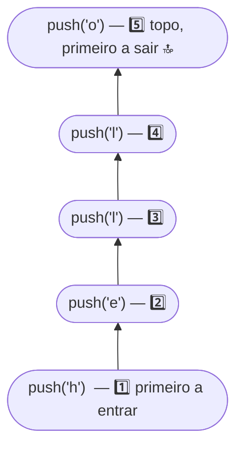
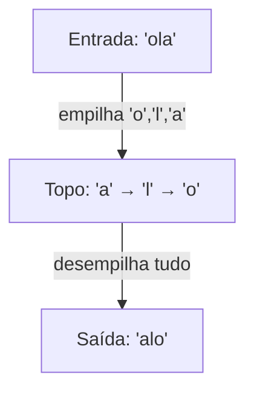

<h1 align="center">🥞 Pilhas (Stacks)</h1>

<p align="center">
    
    
    
    
    
</p>

> 📘 Material de apoio da **aula 03** — o que é uma **pilha (stack)**, a ordem **LIFO**, as operações de empilhar/desempilhar e um exemplo prático de inversão de palavra, com implementações em **C** e **C++**.

<h2 align="left">🧭 Sumário</h2>

1. [O que é uma pilha](#1-o-que-e-uma-pilha)
2. [LIFO — Last In, First Out](#2-lifo)
3. [Anatomia de um nó da pilha](#3-anatomia-de-um-no-da-pilha)
4. [Operações sobre a pilha](#4-operacoes-sobre-a-pilha)
   - [4.1 Empilhar (push)](#41-empilhar-push)
   - [4.2 Desempilhar (pop)](#42-desempilhar-pop)
5. [Exemplo prático — inverter uma palavra](#5-exemplo-pratico-inverter-uma-palavra)
6. [Implementação completa](#6-implementacao-completa)
7. [Complexidade das operações](#7-complexidade-das-operacoes)
8. [Onde pilhas aparecem no dia a dia](#8-onde-pilhas-aparecem)
9. [Armadilhas comuns](#9-armadilhas-comuns)
10. [Resumo final](#10-resumo-final)

<h2 align="left" id="1-o-que-e-uma-pilha">🧩 1. O que é uma pilha?</h2>

Uma **pilha** (*stack*) é uma estrutura de dados linear em que a inserção e a remoção acontecem sempre em **uma única extremidade**, chamada de **topo**. Pode ser implementada com um vetor (topo fixo em `indice`) ou, como aqui, com uma **lista encadeada** — o topo é sempre a cabeça da lista.

| Característica | Descrição |
|---|---|
| 🔝 Acesso | Somente pelo **topo** — não é possível acessar o meio diretamente |
| 🔁 Ordem | **LIFO** — *Last In, First Out* |
| ➕ Inserir | `empilhar` / `push` — adiciona no topo |
| ➖ Remover | `desempilhar` / `pop` — remove do topo |
| ⚡ Custo | **O(1)** para empilhar e desempilhar |

<h2 align="left" id="2-lifo">🥞 2. LIFO — Last In, First Out</h2>

O último elemento **empilhado** é sempre o **primeiro** a ser **desempilhado** — como uma pilha de pratos: você só tira o de cima.



> 💡 Essa é a mesma lógica por trás da **pilha de chamadas (call stack)** de funções recursivas — ver [`FUNÇÕES_Recursivas_e_Iterativas.md`](../../exércicios%20-%20aula%2002/.md/FUNÇÕES_Recursivas_e_Iterativas.md).

<h2 align="left" id="3-anatomia-de-um-no-da-pilha">🔬 3. Anatomia de um nó da pilha</h2>

```c
typedef struct No
{
    char dado;
    struct No *prox;
} No;
```

O ponteiro externo `topo` sempre aponta para o **último nó empilhado**; cada nó aponta para o que estava no topo antes dele.

<h2 align="left" id="4-operacoes-sobre-a-pilha">⚙️ 4. Operações sobre a pilha</h2>

<h3 align="left" id="41-empilhar-push">4.1 Empilhar (push)</h3>

Cria um novo nó, faz seu `prox` apontar para o topo atual e o novo nó **se torna** o topo.

```c
No *empilhar(No *topo, char valor)
{
    No *novo = (No *)malloc(sizeof(No));
    novo->dado = valor;
    novo->prox = topo;
    return novo;
}
```

<h3 align="left" id="42-desempilhar-pop">4.2 Desempilhar (pop)</h3>

Guarda o valor do topo em `*valor`, avança o topo para o próximo nó da cadeia e libera o nó removido.

```c
No *desempilhar(No *topo, char *valor)
{
    if(!topo)
    {
        return NULL;
    }
    else
    {
        No *temp = topo;
        *valor = topo->dado;
        topo = topo->prox;
        free(temp);
        return topo;
    }
}
```

> ⚠️ Sempre checar `if(!topo)` antes de desempilhar — tentar remover de uma pilha vazia é uma das armadilhas mais comuns.

<h2 align="left" id="5-exemplo-pratico-inverter-uma-palavra">🧪 5. Exemplo prático — inverter uma palavra</h2>

Empilhar cada caractere da palavra e depois desempilhar todos produz a palavra **invertida** — uma consequência direta da ordem **LIFO**.

```c
void inverter_palavra(char palavra[])
{
    No *pilha = NULL;
    int indice_letra;

    for(indice_letra = 0; palavra[indice_letra] != '\0'; indice_letra++)
    {
        pilha = empilhar(pilha, palavra[indice_letra]);
    }

    printf("Palavra invertida: ");

    while(pilha)
    {
        char letra;
        pilha = desempilhar(pilha, &letra);
        printf("%c", letra);
    }

    printf("\n");
}
```



| Entrada | Ordem de empilhamento | Ordem de desempilhamento | Saída |
|---|---|---|---|
| `"ola"` | `o`, `l`, `a` | `a`, `l`, `o` | `"alo"` |

<h2 align="left" id="6-implementacao-completa">📄 6. Implementação completa</h2>

**C** — [`c/Pilhas.c`](../c/Pilhas.c)

**C++** — [`c++/Pilhas.cc`](../c++/Pilhas.cc)

| Aspecto | C | C++ |
|---|---|---|
| Alocação | `malloc(sizeof(No))` | `new No` |
| Liberação | `free(ponteiro)` | `delete ponteiro` |
| Entrada/saída | `printf` / `scanf` | `cout` / `cin` |

<h2 align="left" id="7-complexidade-das-operacoes">⚖️ 7. Complexidade das operações</h2>

| Operação | Complexidade | Motivo |
|---|---|---|
| Empilhar (`push`) | **O(1)** | Só cria o nó e reconecta o topo |
| Desempilhar (`pop`) | **O(1)** | Só remove o topo e avança o ponteiro |
| Consultar o topo | **O(1)** | Acesso direto via `topo->dado` |
| Buscar um valor qualquer | **O(n)** | Não há acesso direto — só pelo topo |

<h2 align="left" id="8-onde-pilhas-aparecem">🌍 8. Onde pilhas aparecem no dia a dia</h2>

| Aplicação | Como a pilha é usada |
|---|---|
| 📞 Pilha de chamadas (*call stack*) | Cada chamada de função é empilhada; retorna na ordem inversa |
| ↩️ Desfazer (*undo*) em editores | Cada ação é empilhada; "desfazer" remove a última |
| 🌐 Histórico do navegador (voltar) | A última página visitada é a primeira a ser exibida ao voltar |
| 🧮 Avaliação de expressões matemáticas | Parênteses e operadores usam pilhas para validar/calcular |

<h2 align="left" id="9-armadilhas-comuns">🚧 9. Armadilhas comuns</h2>

| ⚠️ Problema | 💥 Consequência | 🛠️ Como evitar |
|---|---|---|
| Desempilhar sem checar se a pilha está vazia | Acesso inválido de memória | Sempre checar `if(!topo)` antes de `desempilhar` |
| Esquecer de atualizar o ponteiro do topo | Pilha "presa" no mesmo estado | Sempre reatribuir `topo = empilhar(...)` / `topo = desempilhar(...)` |
| Não dar `free` nos nós desempilhados | Vazamento de memória | `free(temp)` dentro da própria função de `pop` |
| Confundir topo com fim da lista | Empilhar/desempilhar no lugar errado | Lembrar que o topo é sempre a **cabeça**, não a cauda |

<h2 align="left" id="10-resumo-final">📌 10. Resumo final</h2>

```
┌───────────────────────────────────────────────────────────┐
│  PILHA (STACK)                                              │
├───────────────────────────────────────────────────────────┤
│  🥞 acesso restrito a uma extremidade: o topo                │
│  🔁 ordem LIFO — Last In, First Out                          │
│  ➕ empilhar (push): O(1)                                    │
│  ➖ desempilhar (pop): O(1)                                  │
│  🎯 usada em call stack, undo, histórico, expressões          │
└───────────────────────────────────────────────────────────┘
```

> 🎓 **Conclusão:** a pilha é a estrutura mais simples de acesso restrito, e sua ordem LIFO é a mesma que rege a pilha de chamadas de funções recursivas — entender uma ajuda a entender a outra.
