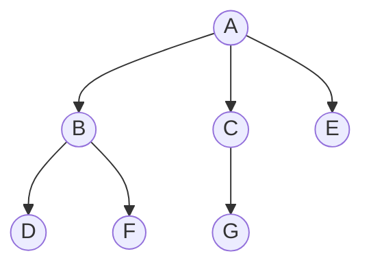
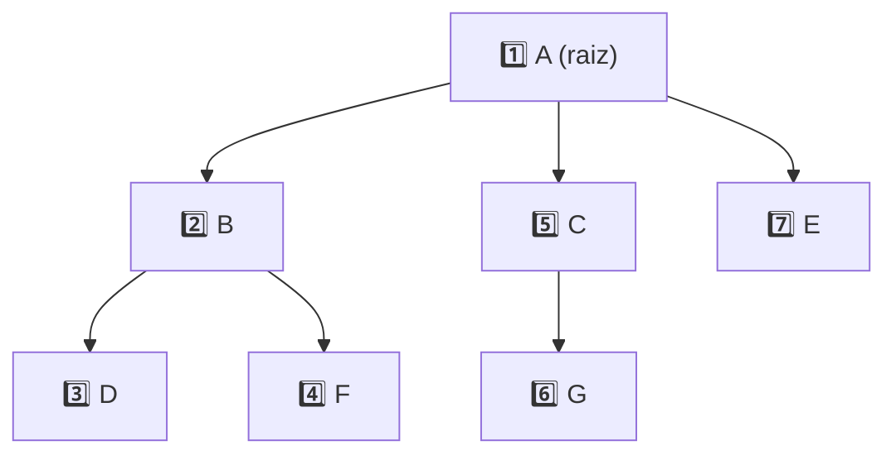
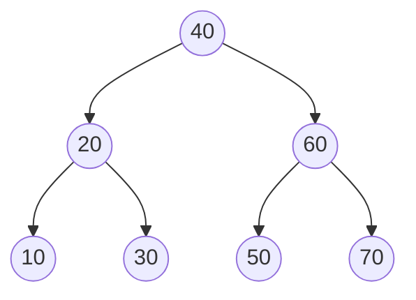
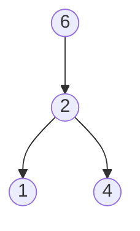
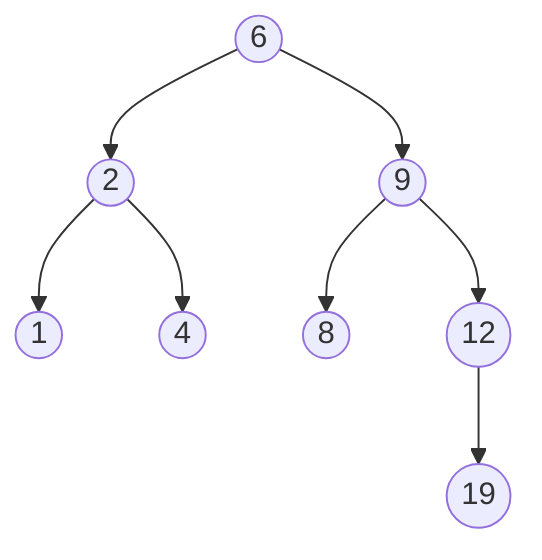
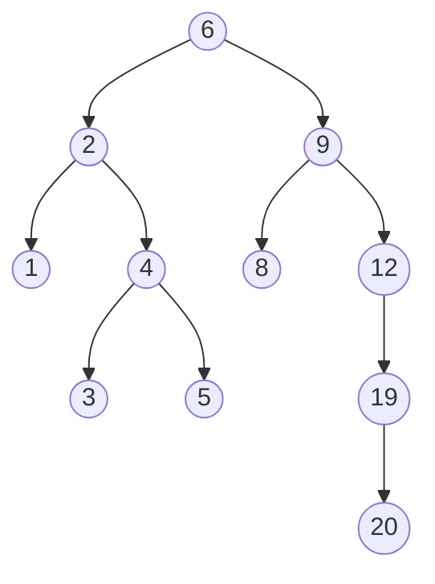
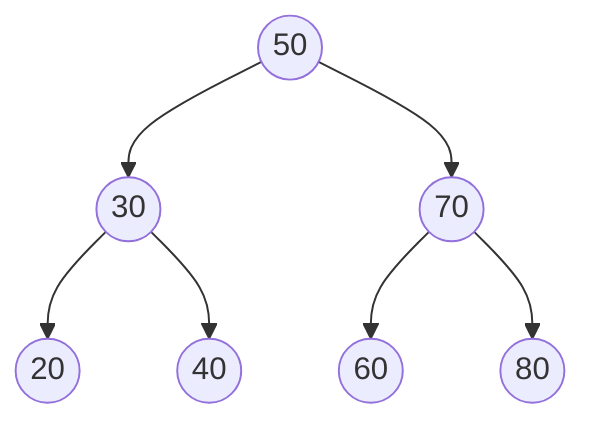
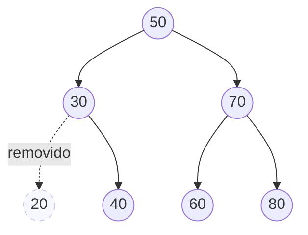
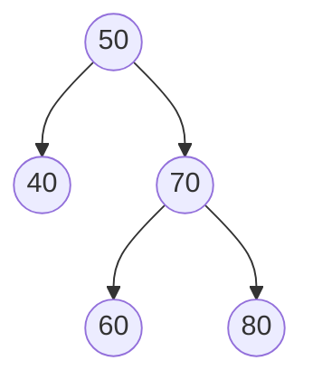
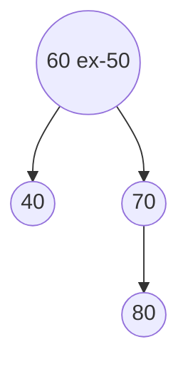

<h1 align="center">🌳 Árvores e Árvores Binárias de Busca (ABB)</h1>

<p align="center">
    
    
    
    
</p>

> 🌳 Material de apoio das **aulas 04 e 05** — *Árvores e suas generalizações*: o que é uma árvore, terminologia, **árvores binárias**, os três **percursos** (pré-ordem, em-ordem, pós-ordem), **Árvores Binárias de Busca (ABB / BST)** com inserção e remoção, um exercício resolvido passo a passo e um guia de como estudar a estrutura **no papel**.

<p align="center">
  
</p>

<h2 align="left">🧭 Sumário</h2>

1. [O que é uma árvore](#1-o-que-e-uma-arvore)
2. [Terminologia](#2-terminologia)
3. [Árvores binárias — anatomia e criação de nós](#3-arvores-binarias)
4. [Percursos em árvores](#4-percursos-em-arvores)
   - [4.1 Pré-ordem](#41-pre-ordem)
   - [4.2 Em-ordem](#42-em-ordem)
   - [4.3 Pós-ordem](#43-pos-ordem)
5. [Árvores Binárias de Busca (ABB / BST)](#5-abb)
6. [Inserção na ABB](#6-insercao-na-abb)
7. [Exercício resolvido — montando uma ABB do zero](#7-exercicio-resolvido)
8. [Remoção na ABB](#8-remocao-na-abb)
9. [Exemplo prático do repositório — `ABB_InserirRemover.cpp`](#9-exemplo-pratico)
10. [Complexidade das operações](#10-complexidade)
11. [Onde árvores aparecem no dia a dia](#11-onde-arvores-aparecem)
12. [Armadilhas comuns](#12-armadilhas-comuns)
13. [Como estudar árvores no papel](#13-como-estudar-no-papel)
14. [Implementação completa e materiais de apoio](#14-implementacao-completa)
15. [Resumo final](#15-resumo-final)

<h2 align="left" id="1-o-que-e-uma-arvore">🌲 1. O que é uma árvore?</h2>

Uma <i>**árvore**</i> é uma estrutura de dados **hierárquica** e **não-linear**, composta por **nós conectados por arestas**. Tecnicamente, é um tipo de **grafo acíclico direcionado**: não existem ciclos, e as conexões seguem sempre a relação **pai → filho**.

> 📘 Diferente de listas, pilhas e filas — que são **lineares** (um elemento após o outro) — a árvore organiza os dados em **níveis**, permitindo representar relações de parentesco entre os dados.

| Estrutura 🏛️ | Organização 📎 | Acesso 🔑 |
|---|---|---|
| [Listas](../../exércicios%20-%20aula%2003/md/LISTAS.MD) | Linear | Sequencial |
| [Pilhas](../../exércicios%20-%20aula%2003/md/PILHAS.MD) | Linear (LIFO - Last In, First Out) | Só pelo topo |
| [Filas](../../exércicios%20-%20aula%2003/md/FILAS.md) | Linear (FIFO - First In, First Out) | Só pelas extremidades |
| **Árvores** | <mark><span style="background-color: white; color:#22c55e">**Hierárquica**</span></mark> | Da raiz para os filhos, nível a nível |

Árvores binárias (foco desta aula) são um **caso particular** de árvore, em que cada nó tem **no máximo 2 filhos**. Uma árvore "geral" (a *generalização* do título da aula) pode ter qualquer número de filhos por nó — como a estrutura de pastas do seu computador.

Usos comuns em computação:

- 🗂️ **Sistemas Operacionais** — árvore de diretórios/arquivos;
- 🧬 **Linguagens orientadas a objeto** — hierarquia de herança entre classes;
- 🔍 e muitas outras (índices de banco de dados, compiladores, IA, etc. — ver [seção 11](#11-onde-arvores-aparecem)).

<p align="center">
  
</p>

<h2 align="left" id="2-terminologia">📖 2. Terminologia</h2>

Toda a teoria de árvores gira em torno de um pequeno vocabulário. Usando a árvore de exemplo do slide (`A` na raiz, com filhos `B`, `C`, `E`):



| Termo 🔐 | Definição 🔑 | No exemplo 💻 |
|---|---|---|
| 🌳 Árvore vazia | Árvore que ainda não foi criada | `raiz_arvore == NULL` |
| 🔵 Nó | Cada item/elemento da árvore | `A, B, C, D, E, F, G` |
| 🌲 Raiz | O **primeiro** nó, sem pai | `A` |
| 🍃 Folha | Nó **sem filhos** | `D, F, G, E` |
| 👨‍👦 Pai / Filho | Relação direta entre um nó e o nível abaixo | `A` é **pai** de `B` → `B` é **filho** de `A` |
| 🌿 Sub-árvore | Cada nó, junto com seus descendentes, forma uma sub-árvore | A sub-árvore de `B` contém `{B, D, F}` |
| ⬆️ Ascendente | Qualquer nó "acima" na cadeia de pais | `A` é **ascendente** de `E` |
| ⬇️ Descendente | Qualquer nó "abaixo" na cadeia de filhos | `E` é **descendente** de `A` |

> ⚠️ **Regra importante:** não é possível conectar a raiz **direto** a uma folha, a menos que a árvore tenha **nível 1** (ou seja, apenas raiz + folhas diretas). Cada nó intermediário é, ele mesmo, uma sub-árvore.

<p align="center">
  
</p>

<h2 align="left" id="3-arvores-binarias">🔬 3. Árvores binárias — anatomia e criação de nós</h2>

Uma **árvore binária** restringe cada nó a, no máximo, **2 filhos**: `esquerda_arvore` e `direita_arvore`.

```cpp
struct No
{
    int valor;
    No* esquerda_arvore;
    No* direita_arvore;
};
```

A criação de um nó é sempre igual: aloca memória com `new`, guarda o valor e inicializa os dois ponteiros filhos como vazios.

```cpp
// Função para criar um novo nó
No* novoNo(int valor)
{
    No* novo = new No;
    novo->valor = valor;
    novo->esquerda_arvore = NULL;
    novo->direita_arvore = NULL;
    return novo;
}
```

> 💡 Esse padrão — alocar, inicializar campos, `return` — é o mesmo usado ao criar nós de [listas](../../exércicios%20-%20aula%2003/md/LISTAS.MD) e [pilhas](../../exércicios%20-%20aula%2003/md/PILHAS.MD); a diferença é que aqui existem **dois** ponteiros de continuação em vez de um só (`prox`).

<p align="center">
  
</p>

<h2 align="left" id="4-percursos-em-arvores">🧭 4. Percursos em árvores</h2>

**Percorrer** uma árvore significa visitar todos os seus nós em uma ordem definida. Existem 3 percursos clássicos — todos **recursivos**, todos usando a mesma árvore-base (`A, B, C, D, E, F, G`):

| Percurso 🧭 | Ordem de visita 👣 | Quando usar 🎯 |
|---|---|---|
| 🔵 Pré-ordem | **raiz** → esquerda → direita | Copiar/serializar a estrutura da árvore |
| 🟢 Em-ordem | esquerda → **raiz** → direita | Em uma ABB, devolve os elementos **ordenados** ✅ |
| 🟠 Pós-ordem | esquerda → direita → **raiz** | Apagar a árvore com segurança (filhos antes do pai) |

<h3 align="left" id="41-pre-ordem">4.1 Pré-ordem</h3>

Visita a **raiz primeiro**, depois a sub-árvore esquerda, depois a direita.

```cpp
void preOrdem(No* raiz_arvore) 
{
    if (raiz_arvore != NULL) 
    {
        cout << raiz_arvore->valor;
        preOrdem(raiz_arvore->esquerda_arvore);
        preOrdem(raiz_arvore->direita_arvore);
    }
}
```



Resultado/Output: `A, B, D, F, C, G, E`

<p align="center">
  
</p>

<h3 align="left" id="42-em-ordem">4.2 Em-ordem</h3>

Visita a esquerda **inteira** primeiro, depois a raiz, depois a direita.

```cpp
void emOrdem(No* raiz_arvore) 
{
    if (raiz_arvore != NULL) 
    {
        emOrdem(raiz_arvore->esquerda_arvore);
        cout << raiz_arvore->valor;
        emOrdem(raiz_arvore->direita_arvore);
    }
}
```


Resultado/Output: `D, B, F, A, G, C, E`

> 💡 Em uma **ABB**, o percurso em-ordem sempre devolve os valores em **ordem crescente** — é a forma mais rápida de checar, no papel, se você montou a árvore corretamente (ver [seção 7](#7-exercicio-resolvido)).

<p align="center">
  
</p>

<h3 align="left" id="43-pos-ordem">4.3 Pós-ordem</h3>

Visita esquerda, depois direita, e só **por último** a raiz.

```cpp
void posOrdem(No* raiz_arvore) 
{
    if (raiz_arvore != NULL) 
    {
        posOrdem(raiz_arvore->esquerda_arvore);
        posOrdem(raiz_arvore->direita_arvore);
        cout << raiz_arvore->valor;
    }
}
```


Resultado/Output: `D, F, B, G, C, E, A`

<p align="center">
  
</p>

<h2 align="left" id="5-abb">🔎 5. Árvores Binárias de Busca (ABB / BST)</h2>

<p align="center">
  
</p>

Uma **Árvore Binária de Busca** (*Binary Search Tree*) é uma árvore binária com uma regra extra de organização, que a torna eficiente para buscas:

| Regra 📏 | Descrição 📝 |
|---|---|
| 🚫 Sem repetição | **Não** permite chaves repetidas |
| ⬅️ Sub-árvore esquerda | Todos os valores são **menores** que o nó |
| ➡️ Sub-árvore direita | Todos os valores são **maiores** que o nó |
| 🔁 Recursividade | Toda sub-árvore de uma ABB **também é uma ABB** |



> 💡 É essa regra ("menor à esquerda, maior à direita") que faz o percurso **em-ordem** devolver os elementos ordenados — e é por isso que a busca em uma ABB balanceada custa **O(log n)** em vez de **O(n)**: a cada comparação, metade da árvore é descartada, igual a uma busca binária em vetor.

<p align="center">
  
</p>

<h2 align="left" id="6-insercao-na-abb">➕ 6. Inserção na ABB</h2>

A inserção segue **exatamente a mesma lógica da busca**:

1. Se a árvore (ou sub-árvore) estiver vazia → o novo nó **vira a raiz** dali;
2. Se o valor for **menor** que o nó atual → desce para a **esquerda**;
3. Se o valor for **maior** que o nó atual → desce para a **direita**;
4. O processo se repete até achar uma posição **vazia**.

<p align="center">
  
</p>

```cpp
// Função para inserir um valor na árvore binária de busca
No* inserir(No* raiz_arvore, int valor)
{
    // Se a árvore estiver vazia, cria um novo nó
    if (raiz_arvore == NULL)
    {
        return novoNo(valor);
    }

    // Se o valor for menor, insere na sub-árvore esquerda
    if (valor < raiz_arvore->valor)
    {
        raiz_arvore->esquerda_arvore = inserir(raiz_arvore->esquerda_arvore, valor);
    }
    // Se o valor for maior, insere na sub-árvore direita
    else if (valor > raiz_arvore->valor)
    {
        raiz_arvore->direita_arvore = inserir(raiz_arvore->direita_arvore, valor);
    }

    return raiz_arvore; // Retorna a raiz atualizada
}
```

> ⚠️ **Ponto-chave:** cada chamada recursiva **reatribui** o ponteiro (`raiz_arvore->esquerda_arvore = inserir(...)`). Esquecer essa atribuição é a armadilha nº 1 — a árvore fica com o mesmo formato de antes, como se nada tivesse sido inserido (ver [seção 12](#12-armadilhas-comuns)).

<p align="center">
  
</p>

<h2 align="left" id="7-exercicio-resolvido">🧪 7. Exercício resolvido — montando uma ABB do zero</h2>

<p align="center">
  
</p>

**Enunciado:** monte a Árvore Binária de Busca para os elementos, na ordem de inserção:

```
6, 2, 4, 1, 9, 8, 12, 19, 5, 3, 20
```

**Tabela de rastreamento** (é assim que se resolve no papel — comparação por comparação):

| # 🔢 | Valor 🔑 | Caminho percorrido (comparações) 🧮 | Onde entra 📍 |
|---|---|---|---|
| 1 | `6` | árvore vazia | `raiz = 6` |
| 2 | `2` | `6` → 2<6 ⇒ esquerda vazia | `6.esq = 2` |
| 3 | `4` | `6` → 4<6 ⇒ esq(`2`) → 4>2 ⇒ direita vazia | `2.dir = 4` |
| 4 | `1` | `6` → 1<6 ⇒ esq(`2`) → 1<2 ⇒ esquerda vazia | `2.esq = 1` |
| 5 | `9` | `6` → 9>6 ⇒ direita vazia | `6.dir = 9` |
| 6 | `8` | `6` → 8>6 ⇒ dir(`9`) → 8<9 ⇒ esquerda vazia | `9.esq = 8` |
| 7 | `12` | `6` → 12>6 ⇒ dir(`9`) → 12>9 ⇒ direita vazia | `9.dir = 12` |
| 8 | `19` | `6`→`9`→`12` → 19>12 ⇒ direita vazia | `12.dir = 19` |
| 9 | `5` | `6` → 5<6 ⇒ esq(`2`) → 5>2 ⇒ dir(`4`) → 5>4 ⇒ direita vazia | `4.dir = 5` |
| 10 | `3` | `6` → 3<6 ⇒ esq(`2`) → 3>2 ⇒ dir(`4`) → 3<4 ⇒ esquerda vazia | `4.esq = 3` |
| 11 | `20` | `6`→`9`→`12`→`19` → 20>19 ⇒ direita vazia | `19.dir = 20` |

**Construção passo a passo** (checkpoints para praticar redesenhar no papel):

*Depois de inserir `6, 2, 4, 1`:*



*Depois de inserir `9, 8, 12, 19`:*



*Árvore final, após `5, 3, 20`:*



**Níveis da árvore final:**

| Nível 📶 | Nós 🔵 |
|---|---|
| 0 (raiz) | `6` |
| 1 | `2`, `9` |
| 2 | `1`, `4`, `8`, `12` |
| 3 | `3`, `5`, `19` |
| 4 | `20` |

**Conferindo com os percursos:**

| Percurso 🧭 | Resultado 📤 |
|---|---|
| Pré-ordem | `6, 2, 1, 4, 3, 5, 9, 8, 12, 19, 20` |
| **Em-ordem** | `1, 2, 3, 4, 5, 6, 8, 9, 12, 19, 20` ✅ (ordenado — confirma que a ABB está correta) |
| Pós-ordem | `1, 3, 5, 4, 2, 8, 20, 19, 12, 9, 6` |

> ⚠️ **Repare:** o ramo direito (`6 → 9 → 12 → 19 → 20`) tem altura 4, enquanto o esquerdo tem altura 2. A árvore **não está balanceada** — ela funciona, mas na pior das hipóteses (uma sequência já ordenada) uma ABB pode degenerar em uma lista encadeada disfarçada. É exatamente esse o motivo de existirem árvores balanceadas como AVL e Rubro-Negra (fora do escopo desta aula, mas bom saber que existem).

<h2 align="left" id="8-remocao-na-abb">➖ 8. Remoção na ABB</h2>

A remoção é a operação mais delicada, porque **três casos** podem acontecer:

| Caso 🎯 | Situação 🔎 | O que fazer 🛠️ |
|---|---|---|
| 1️⃣ | Nó **sem filhos** (folha) | Remove diretamente |
| 2️⃣ | Nó com **um filho** | O filho **substitui** o nó removido |
| 3️⃣ | Nó com **dois filhos** | Substitui pelo **sucessor** (o menor valor da sub-árvore direita), depois remove o sucessor de onde ele estava |

<p align="center">
  
</p>

```cpp
// Função para encontrar o menor valor em uma sub-árvore
No* encontrarMinimo(No* no_atual)
{
    // O menor valor está na extrema esquerda
    while (no_atual->esquerda_arvore != NULL)
    {
        no_atual = no_atual->esquerda_arvore;
    }
    return no_atual;
}

// Função para remover um valor da árvore
No* remover(No* raiz_arvore, int valor)
{
    if (raiz_arvore == NULL)
    {
        return raiz_arvore; // Caso base: árvore vazia
    }

    // Se o valor for menor, busca na sub-árvore esquerda
    if (valor < raiz_arvore->valor)
    {
        raiz_arvore->esquerda_arvore = remover(raiz_arvore->esquerda_arvore, valor);
    }
    // Se o valor for maior, busca na sub-árvore direita
    else if (valor > raiz_arvore->valor)
    {
        raiz_arvore->direita_arvore = remover(raiz_arvore->direita_arvore, valor);
    }
    else
    {
        // Caso 1: Nó sem filhos
        if (raiz_arvore->esquerda_arvore == NULL && raiz_arvore->direita_arvore == NULL)
        {
            delete raiz_arvore;
            return NULL;
        }
        // Caso 2: Nó com um filho
        else if (raiz_arvore->esquerda_arvore == NULL)
        {
            No* temp = raiz_arvore->direita_arvore;
            delete raiz_arvore;
            return temp;
        }
        else if (raiz_arvore->direita_arvore == NULL)
        {
            No* temp = raiz_arvore->esquerda_arvore;
            delete raiz_arvore;
            return temp;
        }

        // Caso 3: Nó com dois filhos — encontra o sucessor
        No* temp = encontrarMinimo(raiz_arvore->direita_arvore);
        raiz_arvore->valor = temp->valor;          // substitui o valor
        raiz_arvore->direita_arvore = remover(raiz_arvore->direita_arvore, temp->valor); // remove o sucessor
    }

    // Retorna a raiz atualizada
    return raiz_arvore;
}
```

<p align="center">
  
</p>

<h2 align="left" id="9-exemplo-pratico">💻 9. Exemplo prático do repositório — <code>ABB_InserirRemover.cpp</code></h2>

O arquivo [`cpp/ABB_InserirRemover.cpp`](../cpp/ABB_InserirRemover.cpp) implementa tudo isso em C++ e demonstra **os três casos de remoção na mesma execução**: insere `50, 30, 70, 20, 40, 60, 80` e depois remove `20` (sem filhos), `30` (um filho) e `50` (dois filhos).

**Árvore após todas as inserções:**



**Passo 1 — `remover(20)`** → Caso 1 (folha, sem filhos): removido diretamente.



**Passo 2 — `remover(30)`** → Caso 2 (um filho, `40`): o filho `40` substitui `30`.



**Passo 3 — `remover(50)`** → Caso 3 (dois filhos, `40` e `70`): sucessor = menor valor da sub-árvore direita = `60`. `50` vira `60`, e o `60` original (folha) é removido.



| Etapa 🪜 | Em-ordem resultante 📋 | Conferência ✅ |
|---|---|---|
| Após inserções | `20, 30, 40, 50, 60, 70, 80` | ✅ ordenado |
| Após remover `20, 30, 50` | `40, 60, 70, 80` | ✅ ainda ordenado — a ABB continua válida |

<h2 align="left" id="10-complexidade">⚖️ 10. Complexidade das operações</h2>

| Operação | Árvore balanceada | Árvore degenerada (pior caso) | Motivo |
|---|---|---|---|
| 🔍 Busca | **O(log n)** | **O(n)** | Depende da **altura** da árvore |
| ➕ Inserção | **O(log n)** | **O(n)** | Mesma lógica da busca + criação do nó |
| ➖ Remoção | **O(log n)** | **O(n)** | Busca + reorganização (até os 3 casos) |
| 🧭 Percurso completo (qualquer ordem) | **O(n)** | **O(n)** | Precisa visitar **todos** os nós, sempre |

> 💡 "Degenerada" é a árvore que vira, na prática, uma lista encadeada — acontece quando os valores são inseridos **já ordenados** (ex.: `1, 2, 3, 4, 5...`). Compare com a árvore do [exercício da seção 7](#7-exercicio-resolvido): o ramo `9 → 12 → 19 → 20` já mostra esse risco.

<h2 align="left" id="11-onde-arvores-aparecem">🌍 11. Onde árvores aparecem no dia a dia</h2>

| Aplicação 🎯 | Como a árvore é usada 🔍 |
|---|---|
| 🗂️ Sistemas de arquivos | Diretórios e subdiretórios formam uma árvore |
| 🧬 Herança em OO | Hierarquia de classes (superclasse → subclasses) |
| 🌐 DOM do navegador | HTML é interpretado como uma árvore de elementos |
| 🗃️ Índices de banco de dados | B-Trees / B+Trees aceleram buscas em milhões de registros |
| 🧠 Árvores de decisão (IA/ML) | Cada nó é uma pergunta; cada folha, uma decisão |
| 📝 Compiladores | AST (Árvore de Sintaxe Abstrata) representa o código-fonte |
| 🏆 Torneios eliminatórios (*brackets*) | Cada rodada é um nível da árvore binária |

<h2 align="left" id="12-armadilhas-comuns">🚧 12. Armadilhas comuns</h2>

| ⚠️ Problema | 💥 Consequência | 🛠️ Como evitar |
|---|---|---|
| Esquecer de checar `raiz_arvore == NULL` | Segmentation fault / recursão infinita | Sempre tratar o caso base **antes** de descer na recursão |
| Não reatribuir o ponteiro (`raiz_arvore->esquerda_arvore = inserir(...)`) | Nó "some" — a árvore não muda de formato | Toda chamada recursiva de `inserir`/`remover` deve **retornar e ser atribuída** |
| Tratar remoção sem checar os 3 casos, na ordem certa | Perde uma sub-árvore inteira ou "vaza" um nó | Testar explicitamente: sem filhos → um filho → dois filhos |
| Inserir valores já ordenados sem perceber | Árvore degenera para O(n), perde a vantagem da ABB | Verificar a altura/balanceamento; em produção, usar AVL/Rubro-Negra |
| Não dar `delete` no nó removido | Vazamento de memória | `delete raiz_arvore` nos casos 1 e 2; no caso 3, o `delete` ocorre na chamada recursiva sobre o sucessor |
| Confundir "sucessor" com "predecessor" no caso 3 | Viola a regra da ABB | Sucessor = **menor valor da sub-árvore direita** (mais à esquerda possível a partir dali) |

<h2 align="left" id="13-como-estudar-no-papel">✏️ 13. Como estudar árvores no papel</h2>

Árvore é uma estrutura **visual** — o papel é, sem dúvida, a melhor ferramenta de estudo antes de escrever qualquer código. Um roteiro prático:

1. **Materiais:** papel quadriculado (ajuda a manter os níveis alinhados), lápis + borracha, e duas cores (ex.: 🔵 azul para `esquerda`, 🔴 vermelho para `direita`) — facilita enxergar o padrão da ABB de longe.
2. **Desenhe a raiz sempre no topo**, centralizada, e vá descendo nível por nível — nunca comece pela esquerda ou pela direita da folha.
3. **Simule a inserção com uma tabela de rastreamento** (igual à da [seção 7](#7-exercicio-resolvido)): para cada valor, escreva o caminho percorrido (comparação a comparação) antes de desenhar a seta — isso é o que o computador faz na recursão, e escrever obriga você a fazer a comparação de verdade, sem "achismo".
4. **Depois de montar, escreva os 3 percursos ao lado da árvore.** Se o **em-ordem** não sair em ordem crescente, você errou uma comparação em algum ponto — volte e confira.
5. **Pratique remoção com os 3 casos separados.** Desenhe a mesma árvore três vezes e remova: (a) uma folha, (b) um nó com um filho, (c) um nó com dois filhos — como no [exemplo da seção 9](#9-exemplo-pratico). Force-se a achar o sucessor (menor valor da sub-árvore direita) manualmente, seguindo as setas até não haver mais filho à esquerda.
6. **Ativação de memória (active recall):** depois de resolver um exercício, cubra o papel e tente redesenhar a árvore final de cabeça, só com a sequência de inserção. Comparar o resultado é o que fixa o padrão.
7. **Sempre marque o nível de cada nó** (0, 1, 2...) e calcule a altura final — isso cria o hábito de perceber quando uma árvore está degenerando, que é o erro conceitual mais cobrado em prova.
8. **Desenhe árvores "armadilha"** de propósito: insira uma sequência já ordenada (ex.: `1, 2, 3, 4, 5`) e veja no papel como ela vira uma "lista disfarçada" — sentir isso na mão ajuda a entender por que existe árvore balanceada.
9. **Revise com os PDFs do repositório:** [`Exercicios para AV1.pdf`](../../pdf/Exercicios%20para%20AV1.pdf) e [`Simulado.pdf`](../../pdf/Simulado.pdf) trazem listas de exercícios — refaça-os no papel primeiro, só depois confira/implemente no código.
10. **Estude em blocos curtos (Pomodoro):** 25 min desenhando árvores + 5 min de pausa rende mais do que uma sessão longa, porque cada exercício exige atenção total às comparações.

<h2 align="left" id="14-implementacao-completa">📄 14. Implementação completa e materiais de apoio</h2>

**C++** — [`cpp/ABB_InserirRemover.cpp`](../cpp/ABB_InserirRemover.cpp) — inserção, busca, remoção (3 casos) e percurso em-ordem, com exemplo executável em `main()`.

| Material 📚 | Local 📍 |
|---|---|
| 📊 Slides — Aula 04 | [`pdf/Aula 04 - Árvores e suas generalizações...pdf`](../../pdf/Aula%2004%20-%20Árvores%20e%20suas%20generalizações%20árvores%20binárias,%20árvores%20de%20busca.pdf) |
| 📊 Slides — Aula 05 | [`pdf/Aula 05 - Árvores e suas generalizações...pdf`](../../pdf/Aula%2005%20-%20Árvores%20e%20suas%20generalizações%20árvores%20binárias,%20árvores%20de%20busca.pdf) |
| 📝 Exercícios para AV1 | [`pdf/Exercicios para AV1.pdf`](../../pdf/Exercicios%20para%20AV1.pdf) |
| 🧪 Simulado | [`pdf/Simulado.pdf`](../../pdf/Simulado.pdf) |
| 💻 Código-fonte da ABB | [`cpp/ABB_InserirRemover.cpp`](../cpp/ABB_InserirRemover.cpp) |

| Aspecto 🔧 | C (slides) 📘 | C++ (repositório) 💻 |
|---|---|---|
| Struct | `struct No { int valor; No *esquerda, *direita; }` | `struct No { int valor; No* esquerda; No* direita; }` |
| Alocação | `(No*)malloc(sizeof(No))` | `new No` |
| Liberação | `free(ponteiro)` | `delete ponteiro` |
| Entrada/saída | `printf` / `scanf` | `cout` / `cin` |

<h2 align="left" id="15-resumo-final">📌 15. Resumo final</h2>

```
┌───────────────────────────────────────────────────────────────┐
│  ÁRVORES (TREES)                                                │
├───────────────────────────────────────────────────────────────┤
│  🌳 estrutura hierárquica, não-linear (grafo acíclico)           │
│  🔬 árvore binária: no máximo 2 filhos (esquerda / direita)      │
│  🧭 3 percursos: pré-ordem, em-ordem, pós-ordem                  │
│  🔎 ABB: esquerda < nó < direita, sem repetição                  │
│  ➕ inserir: O(log n) balanceada / O(n) degenerada                │
│  ➖ remover: 3 casos — sem filhos, 1 filho, 2 filhos (sucessor)   │
│  🟢 em-ordem numa ABB = valores ordenados (forma de conferir)    │
└───────────────────────────────────────────────────────────────┘
```

> 🎓 **Conclusão:** a Árvore Binária de Busca é a primeira estrutura não-linear do curso, e sua eficiência depende inteiramente do quão **balanceada** ela está. Dominar a inserção e a remoção no papel — comparação por comparação, caso por caso — é o que torna o código (`inserir`/`remover` recursivos) quase óbvio depois.
